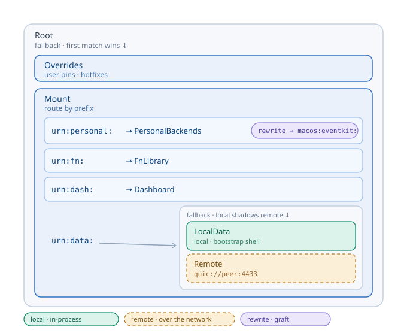
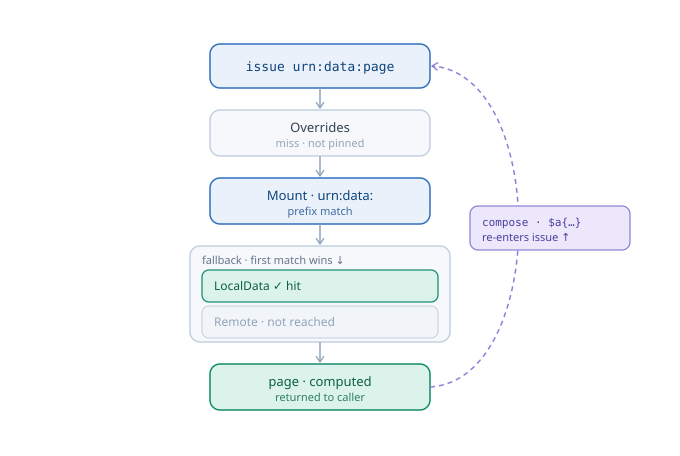
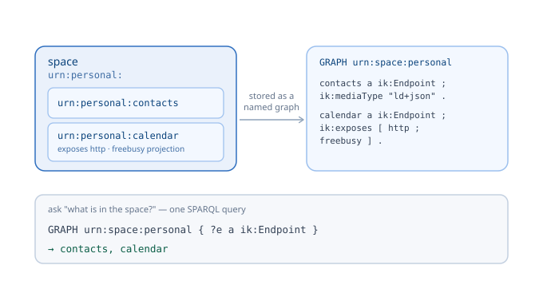

# Spaces: composition, resolution, and named-graph representation (design draft)

**Status:** design draft. Companion to
[`resolution-architecture.md`](resolution-architecture.md) (§1) and
[`vocab/`](vocab/). Placeholder namespaces.

This document does three things: shows how spaces **compose**, how **resolution**
walks the composition, and how the whole thing is **represented as named graphs
in oxigraph** so you can *query* what's in a space. The pictures carry most of
the weight — the RDF underneath is just the boxes written down.

---

## 1. Spaces compose into a stack

The kernel's root space is a tree built from four primitives (already in
`space.rs`): `EndpointSpace` (binds IRIs → endpoints), `Mount` (prefix → space),
`Fallback` (ordered list, first match wins), `Rewrite` (rewrite the IRI on the
way down). A realistic personal kernel:



- **Fallback** is precedence/overlay. It appears twice — `Overrides` shadow
  everything at the root, and under `urn:data:` a **LocalData** layer shadows a
  **Remote** peer (the stacked local+remote of #25).
- **Mount** is prefix routing — which space *owns* a prefix.
- **Rewrite** is the "bind in your own namespace, the host grafts it public"
  move: `PersonalBackends` internally binds `macos:eventkit:*`, and the host
  rewrites the public `urn:personal:` onto it.
- **Remote** is a `Space` whose `resolve` forwards an `ikigai-wire` request over
  a transport.

Nesting is embedding: a space *contains* other spaces, and precedence/routing
are explicit structure — never implicit.

---

## 2. Resolution is a walk through the stack



Resolving `issue(urn:data:page)`: the root `Fallback` tries `Overrides` (miss),
the `Mount` matches the `urn:data:` prefix, its nested `Fallback` hits
`LocalData` (so `Remote` is never reached), and the endpoint returns the page.
The dashed loop is the important part: when the page `compose`s, each `$a{…}`
marker calls `inv.issue(...)`, which **re-enters at the root** — so one composite
can pull some fragments locally and some from the peer, the boundary invisible.

`urn:personal:calendar` under an attenuated free/busy capability walks the same
way: `Overrides` miss → `Mount` matches `urn:personal:` → `Rewrite` maps it to
`macos:eventkit:calendar` → the capability projects busy-blocks only (kernel-side
transreption).

---

## 3. A space *is* a named graph

Here's where the RDF stops being scary. A space is "a named set of bindings" —
which is exactly what a **named graph** is. So each space becomes one named graph
whose triples are its endpoints' self-descriptions (the same manifest RDF from
[`vocab/`](vocab/)), and "what's in the space?" is one query.



### Two kinds of graph

**(a) One named graph per space** — its endpoints and their descriptions:

```turtle
# GRAPH <urn:space:personal>
<urn:personal:contacts> a ik:Endpoint ; ik:mediaType "application/ld+json" ;
    ik:backend [ ikp:macos "eventkit:contacts" ] .
<urn:personal:calendar> a ik:Endpoint ; ik:mediaType "text/calendar" ;
    ik:exposes [ ik:transport "http" ; ik:projection <urn:personal:fn:freebusy> ] .
```

**(b) A topology graph** — the stack itself, as RDF (the picture in §1, written
down):

```turtle
# GRAPH <urn:space:meta>
<urn:kernel:root> a ik:Fallback ; ik:layers ( <urn:space:overrides> <urn:kernel:main> ) .
<urn:kernel:main> a ik:Mount ;
    ik:mount [ ik:prefix "urn:personal:" ; ik:space <urn:space:personal> ;
               ik:rewrite [ ik:from "urn:personal:" ; ik:to "macos:eventkit:" ] ] ,
             [ ik:prefix "urn:fn:"   ; ik:space <urn:space:fn> ] ,
             [ ik:prefix "urn:dash:" ; ik:space <urn:space:dash> ] ,
             [ ik:prefix "urn:data:" ; ik:space <urn:space:data-stack> ] .
<urn:space:data-stack> a ik:Fallback ; ik:layers ( <urn:space:local-data> <urn:space:remote-peer> ) .
<urn:space:remote-peer> a ik:RemoteSpace ; ik:transport "quic://peer:4433" ; ik:signer <did:key:z6Mk…> .
```

### Topology vocabulary

| term | meaning |
|------|---------|
| `ik:EndpointSpace` / `ik:Mount` / `ik:Fallback` / `ik:Rewrite` / `ik:RemoteSpace` | the space-node types |
| `ik:layers` | an `rdf:List` — Fallback order (precedence) |
| `ik:mount` | a Mount entry: `ik:prefix` + `ik:space` (+ optional `ik:rewrite`) |
| `ik:prefix` | the IRI prefix a Mount entry routes |
| `ik:space` | points at a space's named graph (or another topology node) |
| `ik:rewrite` / `ik:from` / `ik:to` | the IRI rewrite applied on the way down |
| `ik:transport` | a RemoteSpace's wire address |
| `ik:Endpoint` | a binding in a space graph (carries the module-vocab description) |

---

## 4. Querying spaces (SPARQL over oxigraph)

**What's in the personal space?**
```sparql
SELECT ?endpoint ?mediaType WHERE {
  GRAPH <urn:space:personal> { ?endpoint a ik:Endpoint ; ik:mediaType ?mediaType }
}
```

**What's exposed over HTTP anywhere?** (the #19 opt-in surface)
```sparql
SELECT ?space ?endpoint WHERE {
  GRAPH ?space { ?endpoint ik:exposes [ ik:transport "http" ] }
}
```

**Which space would `urn:personal:contacts` route to?** (query the topology)
```sparql
SELECT ?space WHERE {
  <urn:kernel:main> ik:mount [ ik:prefix ?p ; ik:space ?space ] .
  FILTER(STRSTARTS("urn:personal:contacts", ?p))
}
```

**The *effective* view of the stacked `urn:data:` space** — what actually
resolves, with local shadowing remote. This *is* the `Fallback` precedence rule,
expressed as a query:
```sparql
SELECT ?iri (IF(BOUND(?l), "local", "remote") AS ?from) WHERE {
  { GRAPH <urn:space:local-data>  { ?iri a ik:Endpoint } BIND(true AS ?l) }
  UNION
  { GRAPH <urn:space:remote-peer> { ?iri a ik:Endpoint }
    FILTER NOT EXISTS { GRAPH <urn:space:local-data> { ?iri a ik:Endpoint } } }
}
```

---

## 5. Three things to keep straight

- **The named graph is also the unit of authority and signing.**
  `<urn:space:personal> ik:signer <did:key:…>`, and RDF-dataset canonicalization
  signs a named graph. So "the space's graph" is exactly what the space authority
  signs and what an importer's `signer` gate checks — named-graph ↔ binding
  authority ↔ signing are the same boundary (see `vocab/README.md`).
- **A `RemoteSpace`'s graph isn't local quads.** You either federate
  (`SERVICE` to the peer) or cache a snapshot of its space description. "What's
  in the remote space" is a federated query — the introspection face of stacked
  local+remote (#25).
- **Layering, honestly: the quad store is the canonical, queryable truth; the
  hot path uses a derived index.** You don't run SPARQL on every `issue` in the
  inner loop. Oxigraph holds the source of truth and the introspection surface;
  the runtime keeps an in-memory routing index derived from it, invalidated on
  mount/unmount. Routing *is* conceptually a query over the topology graph;
  performance just caches it. (Consistent with a resolution-first kernel on
  Oxigraph: oxigraph central, index in front.)

The payoff: the **dashboard/control-plane (#20) and the debugger (#30) are just
SPARQL over these graphs** — "show me space X," "what's exposed," "what's the
topology," "why did this route here." The kernel's own structure is a resource
you query through the kernel.
